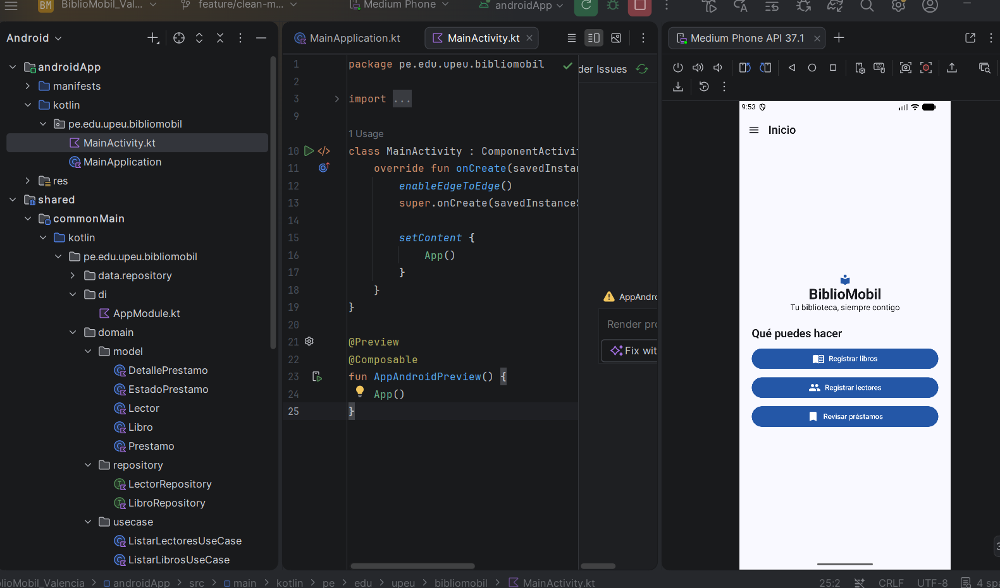
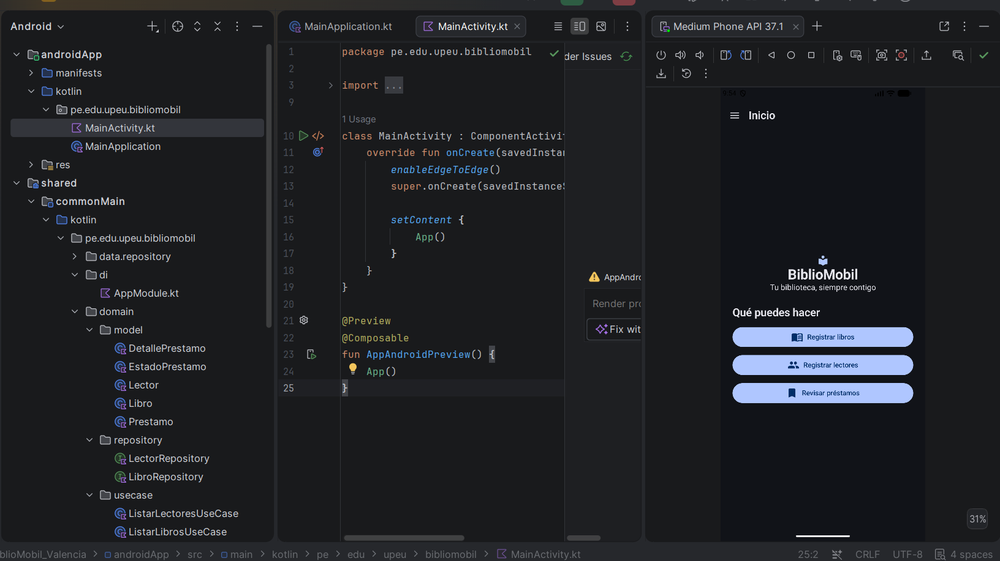
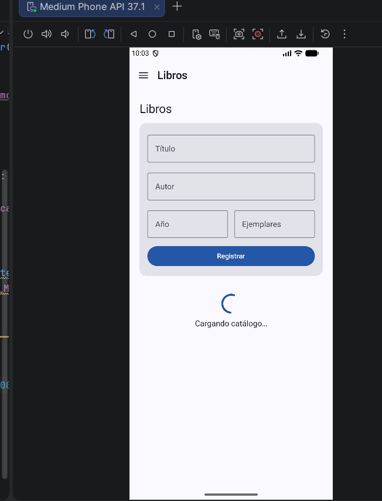
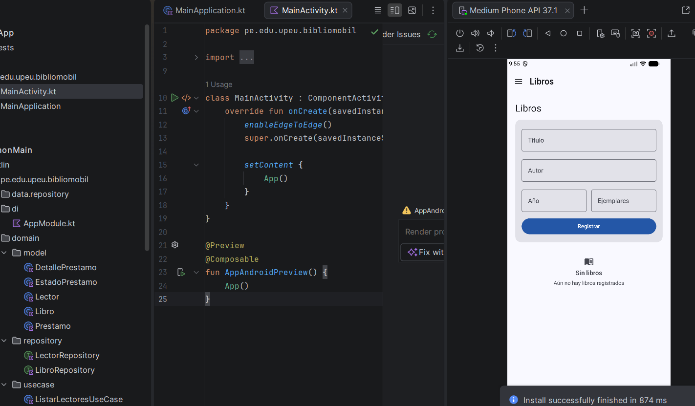
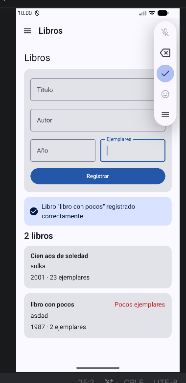
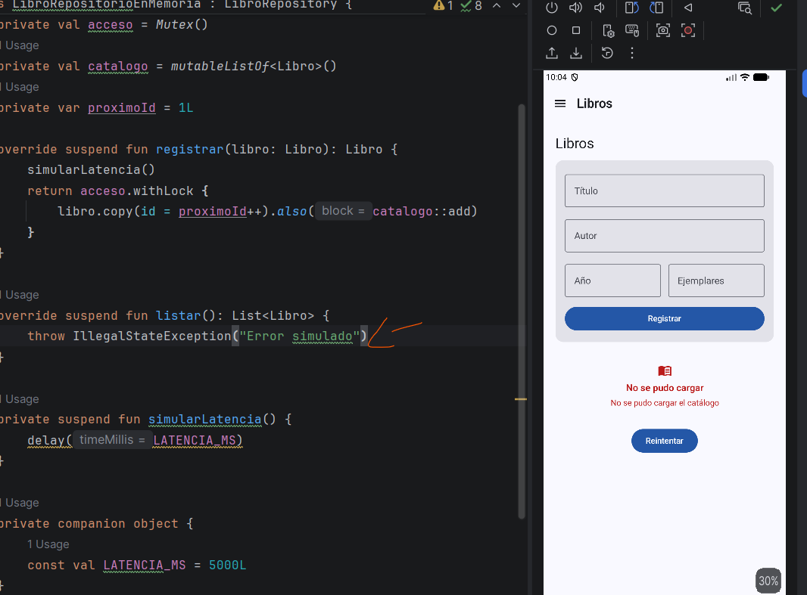
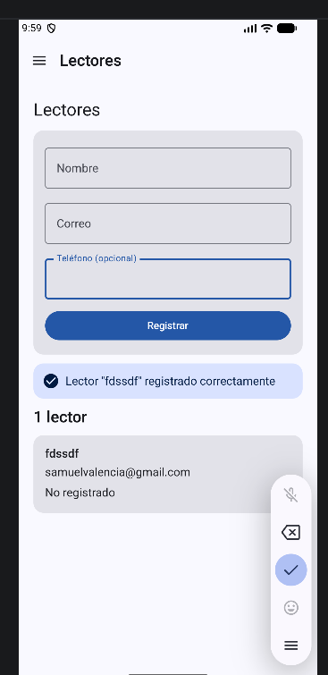
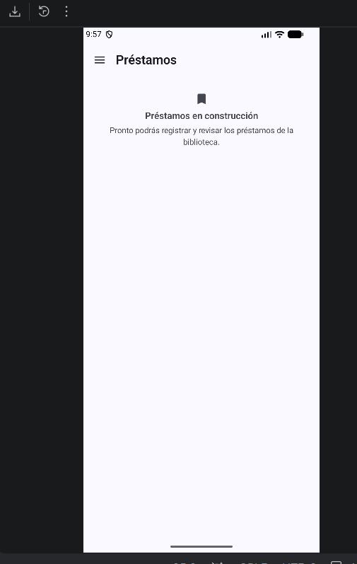
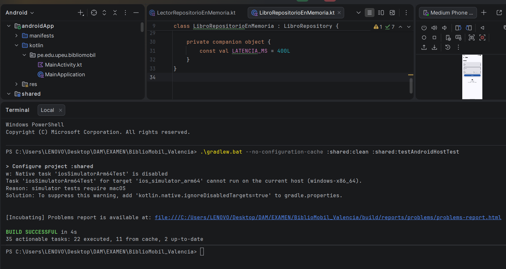

# BiblioMobil

Aplicación móvil multiplataforma para administrar el catálogo y los lectores de una biblioteca. El proyecto fue desarrollado como examen práctico del curso **Desarrollo de Aplicaciones Móviles**, aplicando arquitectura Clean, MVVM, StateFlow, inyección de dependencias y pruebas automatizadas.

| Datos académicos | Información |
|---|---|
| Estudiante | Roberto Samuel Valencia Saavedra |
| Docente | Benjamín David Reyna Barreto |
| Curso | Desarrollo de Aplicaciones Móviles |
| Rama de trabajo | `feature/clean-mvvm` |

## Funcionalidades

- Registro y consulta de libros.
- Aviso de pocos ejemplares cuando el stock es menor que tres.
- Registro y consulta de lectores con teléfono opcional.
- Estados de carga, contenido vacío, contenido disponible y error.
- Navegación mediante menú lateral.
- Pantalla de inicio con accesos rápidos.
- Tema claro y oscuro con identidad visual propia.
- Módulo de préstamos preparado para una implementación posterior.

## Arquitectura

El código compartido se divide en capas con responsabilidades claras:

- `domain`: modelos, contratos de repositorio y reglas del negocio.
- `data`: implementaciones en memoria de los repositorios.
- `presentation`: pantallas, estados de interfaz y ViewModels.
- `di`: módulos de Koin y configuración por plataforma.
- `navigation`: destinos y conservación de la pantalla actual.

Las pantallas trabajan con interfaces y casos de uso, sin depender directamente de la fuente de datos. De esta manera, el repositorio en memoria puede reemplazarse más adelante por una API REST sin cambiar las reglas del negocio ni la interfaz.

## Tecnologías utilizadas

- Kotlin Multiplatform.
- Compose Multiplatform y Material 3.
- Coroutines y StateFlow.
- Koin.
- Kotlin Test y Coroutines Test.
- Android Studio y Gradle.

## Evidencias

### Inicio y navegación

| Tema claro | Tema oscuro |
|---|---|
|  |  |

### Estados del catálogo de libros

| Cargando | Sin libros |
|---|---|
|  |  |

| Con libros | Error de carga |
|---|---|
|  |  |

La vista con registros muestra el formato del año y los ejemplares, además del aviso **Pocos ejemplares** cuando corresponde.

### Lectores y préstamos

| Lector sin teléfono | Préstamos |
|---|---|
|  |  |

## Pruebas automatizadas

El proyecto contiene **34 pruebas reales**, todas aprobadas: 0 fallos, 0 errores y 0 omitidas. Se cubren modelos, validaciones, casos de uso, repositorios, ViewModel e inyección de dependencias.

```powershell
.\gradlew.bat --no-configuration-cache :shared:clean :shared:testAndroidHostTest
```



## Ejecución en Android

1. Abrir el proyecto con Android Studio.
2. Sincronizar Gradle.
3. Seleccionar un emulador Android.
4. Ejecutar la configuración `androidApp`.

La aplicación utiliza repositorios en memoria, por lo que los registros se reinician cuando se cierra completamente el proceso.

## Respuestas teóricas

Las respuestas solicitadas y el resumen de la ejecución de pruebas se encuentran en [`docs/RESPUESTAS.md`](docs/RESPUESTAS.md).
